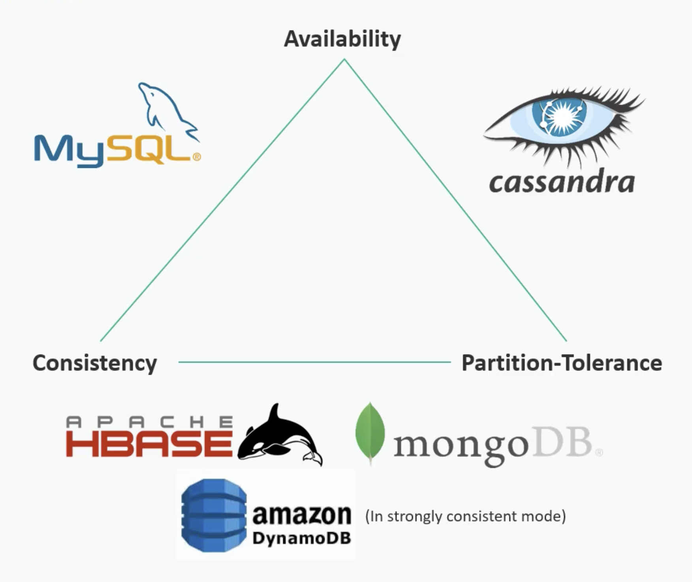

# CAP Theorem

A distributed system can guarantee only two out of the following three properties at the same time:

- Consistency
- Availability
- Partition Tolerence

## Consistency

Do I get back what I just wrote immediately?

- Every read receives the latest written data

---

## Availability

Can the system continue working even if some nodes fail?

- The system continues to respond even if some nodes are down

---

## Partition Tolerance

Can the system continue operating despite network failures?

- The system continues operating even if communication between nodes breaks

---

## Practical Insight

In distributed systems, **Partition Tolerance** is usually mandatory.  
Therefore, systems often choose between:

- **CP Systems** → Prioritize Consistency
- **AP Systems** → Prioritize Availability

