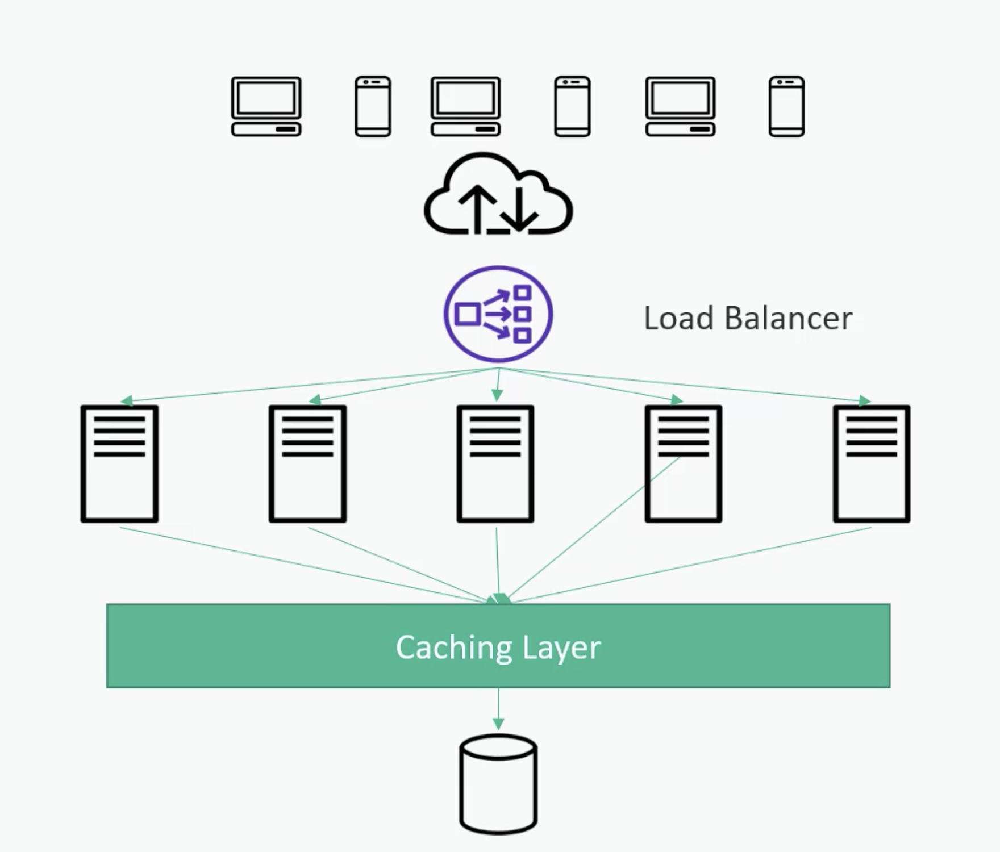
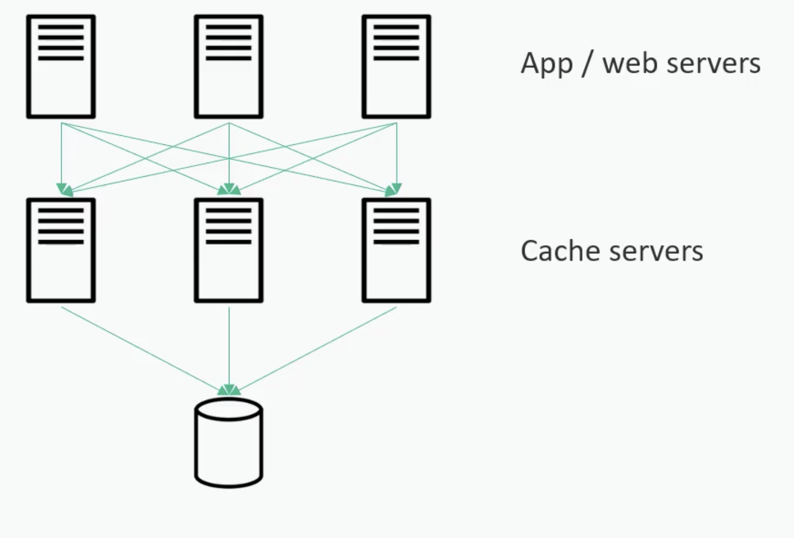
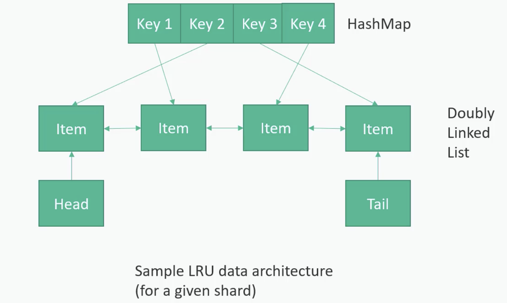
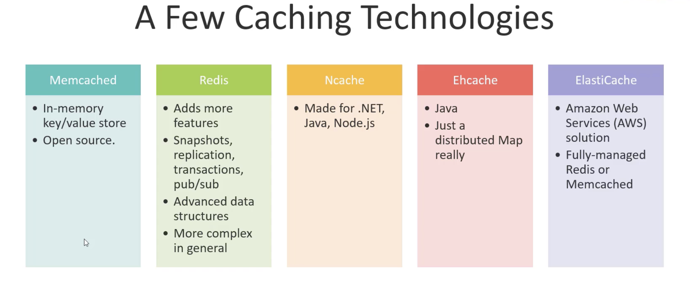

# Caching

- Horizontally scaled servers
- Client hast requests to a given server
- In memory (fast)
- Appropriate for applications with more reads than writes.
- Expiration policy
- Hotspots (the celebrity problem )
- Cold Start is also a problem- initially till cache gets warmed up all requests hit db.

## Caching Layer

## 

## How Caching Works

## Eviction Policy

Cache eviction is the process of removing data from a cache when it becomes full to make space for new or more relevant data

### LRU - Least Recently Used

### LFU - Least Frequently Used

### FIFO - First In First Out

## Caching Technologies

# CDN

A CDN (Content Delivery Network) is a geographically distributed group of servers that caches web content (images, videos, scripts) closer to users. By serving data from the closest server (Point of Presence or "edge" server), it drastically reduces load times and bandwidth costs while preventing origin server overloads.

### CDN Providers

- AWS CloudFront
- Google Cloud CDN
- Microsoft Azure CDN
- CloudFare
