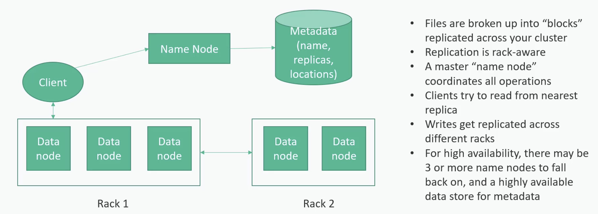

# Scalable Systems

## Scaling Approaches

### Vertical Scaling

Increase the capacity of a single server by adding more CPU, RAM, or storage.

- Simple to implement
- Limited by hardware capacity
- Expensive at scale
- Creates a single point of failure

Example:

- Upgrading a server from 8 GB RAM to 64 GB RAM

---

### Horizontal Scaling

Increase system capacity by adding multiple servers behind a [load balancer](LoadBalancer.md).

- Better fault tolerance
- Easier to scale
- Requires stateless web servers

Example:

- Multiple application servers behind a load balancer

---

## Problem in Horizontal Scaling: Web Servers Must Be Stateless

In horizontally scaled systems, servers should not store user session data locally.

Why?

- Any request can go to any server
- Improves scalability and reliability

---

## Serverless Services

Cloud-managed services where infrastructure management is handled automatically.

Examples:

- AWS Lambda
- AWS Kinesis
- AWS Athena

Benefits:

- Auto scaling
- Pay-per-use
- Reduced operational overhead

---

# Database Scaling & Availability

## Database Single Point of Failure

Using only one database server is risky because if it fails, the entire application may become unavailable.

---

## Database Replication Strategies

[Database Replication Strategies](./DbReplication.md)

---

# Cloud Solutions:

[Cloud Storage & Data Lakes](./CloudSolutions.md)

---

# Database ACID Properties

[ACID Principles](./AcidProperties.md)

---

# Database CAP Theorem

[CAP Theorem](./CAPTheorem.md)

---

# Caching

[Caching](./Caching.md)

---

# Resiliency

- Secondaries should spread across multiple racks, availability zones and regions
- You need to balance budget vs availability. Not every system warrants this
- Provisioning a new server from an offsite backup might be good enough

---

# Scaling the Data

A Service Level Agreement (SLA) is a binding contract between a service provider and a customer.
It defines the exact scope of services, expected performance standards (like uptime, durability, latency or availability (in percentile 99.9999999%)), how service is measured, and penalties for failing to meet these targets.

### Distributed Storage Solutions

- Amazon S3
- Google Cloud Storage
- Microsoft Azure
- Hadoop HDFS
- Consumer oriented storage solutions- Dropbox, Google Drive, iCloud, OneDrive etc

---

# HDFS Architecture

